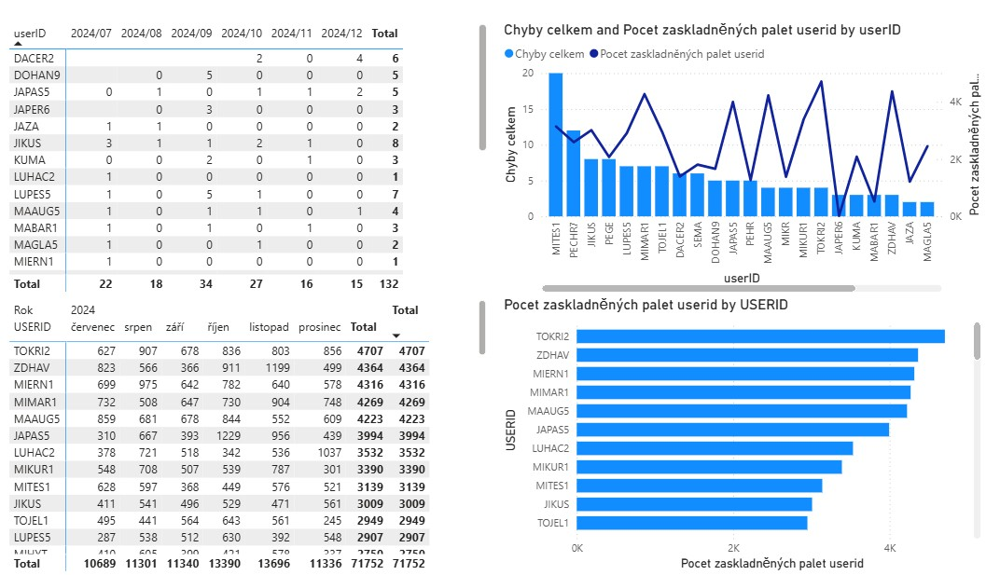

 O projektu

Projekt zaměřený na analýzu chyb při zaskladňování a porovnání chybovosti s výkonem jednotlivých pracovníků.

## Použité technologie

- MySQL Workbench
- SQL
- Power BI

## Dashboard

## Moje role

- návrh databázového modelu
- SQL analýza dat
- příprava dat pro reporting
- napojení MySQL databáze do Power BI
- tvorba dashboardů
- interpretace výsledků

## Hlavní zjištění

Projekt umožnil porovnat počet chyb jednotlivých pracovníků s jejich výkonem a identifikovat oblasti vhodné pro další analýzu.
