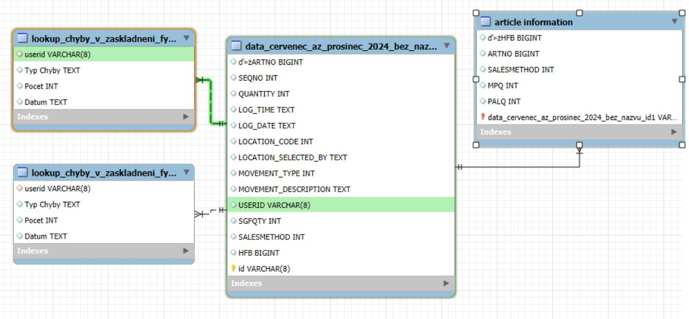

O projektu

Analýza chyb při zaskladňování a jejich vztahu k výkonu pracovníků pomocí SQL, MySQL Workbench a Power BI.

## Kontext projektu

Projekt byl vytvořen v rámci kurzu SQL a Power BI v roce 2024.

## Použité technologie

- MySQL Workbench
- Power BI

## Datový model

Datový model použitý pro propojení skladových dat, informací o chybách zaskladnění a produktových informací.

## Ukázka SQL kódu

Vybrané SQL transformace použité při přípravě dat pro Power BI jsou uloženy ve složce **Ukázka kódu**.

## Dashboard

## Moje role

- návrh databázového modelu
- SQL analýza dat
- příprava dat pro reporting
- napojení MySQL databáze do Power BI
- tvorba dashboardů
- interpretace výsledků

## Hlavní zjištění

Projekt umožnil porovnat počet chyb jednotlivých pracovníků s jejich výkonem a identifikovat oblasti vhodné pro další analýzu.
